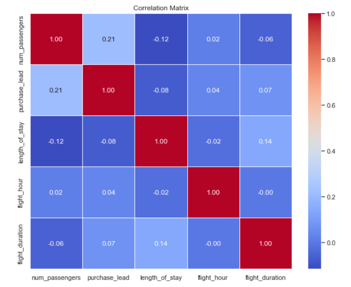
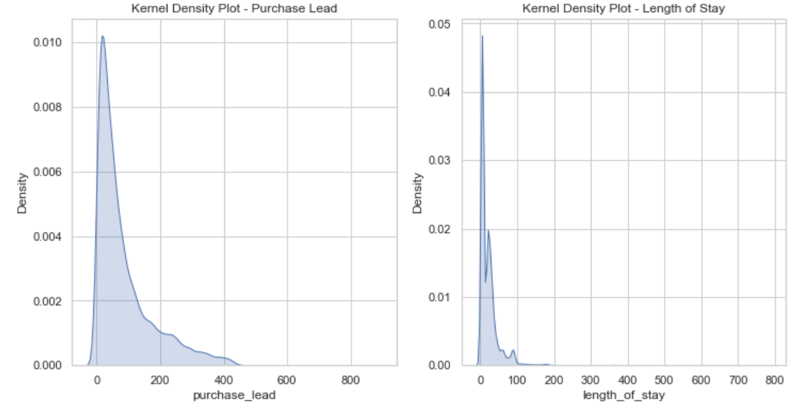
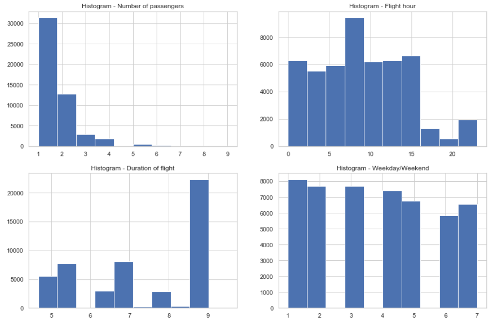
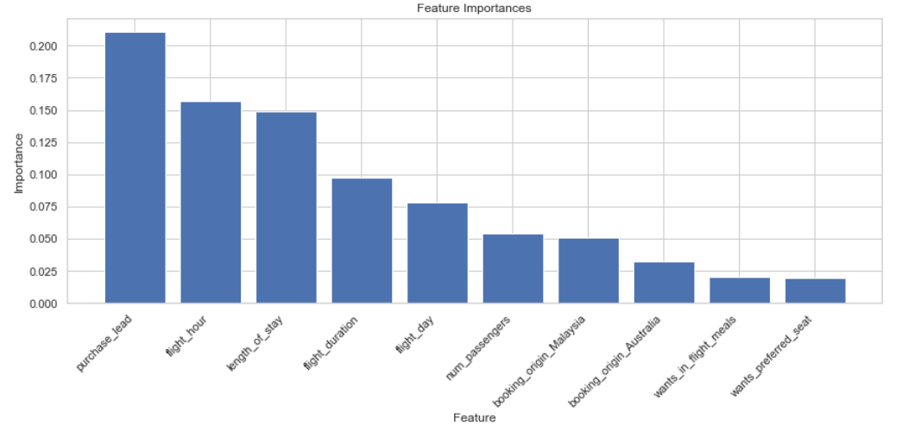

# Predicting Customer behavior

Customers are more empowered than ever because they have access to a wealth of information at their fingertips. Being reactive in today's world is not ideal as the customer has a lot of options to choose from. In this project, we will analyze customer booking data to see if we can identify any underlying pattern and use this to see which factors are important to get a successful booking.

## Data description

- num_passengers = number of passengers travelling
- sales_channel = sales channel booking was made on
- trip_type = trip Type (Round Trip, One Way, Circle Trip)
- purchase_lead = number of days between travel date and booking date
- length_of_stay = number of days spent at destination
- flight_hour = hour of flight departure
- flight_day = day of week of flight departure
- route = origin -> destination flight route
- booking_origin = country from where booking was made
- wants_extra_baggage = if the customer wanted extra baggage in the booking
- wants_preferred_seat = if the customer wanted a preferred seat in the booking
- wants_in_flight_meals = if the customer wanted in-flight meals in the booking
- flight_duration = total duration of flight (in hours)
- booking_complete = flag indicating if the customer completed the booking

## Process

* Data Cleaning
* Exploratory Data analysis (EDA)
* Visualization
* Preparing data for Machine learning model
* Random Forest classifier
* Extracting feature importance
* Cross validation
* Hyperparameter tuning
* Extracting feature importance from the final model

## Visualization

### Checking correlation between features

### Density plots

### EDA

## Extracting feature importance from the final model

